# 🎯 CrashLens Dual Workflow System

You now have **two complementary workflows** for different enforcement levels:

## 📊 **Workflow 1: Comprehensive Analysis** (Non-breaking)
**File:** `.github/workflows/crashlens-scan.yml`

### **Triggers:**
- Push to `main`, `raj` branches
- Pull requests to `main`
- Daily at 6 AM UTC
- Manual dispatch with options

### **Behavior:**
- ✅ **Comprehensive analysis and reporting**
- ❌ **Does NOT break builds** (`CRASHLENS_FAIL_ON_VIOLATIONS: "false"`)
- 🔧 **5 steps with `continue-on-error: true`**
- 📊 **Generates detailed reports and PR comments**
- 🛡️ **Includes security scans and performance analysis**

### **Use Cases:**
- Daily monitoring and reporting
- Comprehensive analysis without disrupting development
- Historical trend tracking
- Educational insights for the team

---

## 🚨 **Workflow 2: Strict Enforcement** (Build-breaking)
**File:** `.github/workflows/crashlens-strict.yml`

### **Triggers:**
- Push to `main` branch only
- Pull requests to `main` only

### **Behavior:**
- 🔥 **STRICT ENFORCEMENT - WILL BREAK BUILDS**
- 💰 **Hard cost limits:** $5.00/day maximum
- ⏱️ **Performance limits:** Max 20 slow traces
- 💸 **Expensive request limits:** Max 10 requests >$0.05
- ❗ **Error rate limits:** Max 20% error rate
- 🔍 **CrashLens policy violations:** `--fail-on-violations` enabled

### **Enforcement Thresholds:**
```yaml
DAILY_COST_LIMIT: 5.00         # $5.00 maximum per day
SLOW_RESPONSE_LIMIT: 20        # Max 20 slow traces
EXPENSIVE_REQUEST_LIMIT: 10    # Max 10 expensive requests
ERROR_RATE_THRESHOLD: 0.20     # Max 20% error rate
```

### **Use Cases:**
- Production deployments
- Critical branch protection
- Budget enforcement
- Quality gates

---

## 🔄 **How They Work Together**

### **Development Flow:**
1. **Feature branches** → Only comprehensive analysis (non-breaking)
2. **Pull requests to main** → Both workflows run
3. **Merges to main** → Strict enforcement kicks in
4. **Daily monitoring** → Comprehensive analysis provides insights

### **Workflow Interaction:**

```mermaid
graph TD
    A[Developer Push] --> B{Branch?}
    B -->|feature branch| C[Comprehensive Analysis Only]
    B -->|main branch| D[Both Workflows]
    D --> E[Comprehensive Analysis]
    D --> F[Strict Enforcement]
    F -->|Pass| G[✅ Deploy]
    F -->|Fail| H[❌ Block Deploy]
```


## 🔧 **Configuration Options**

### **Adjust Strict Limits:**
Edit `.github/workflows/crashlens-strict.yml` lines 56-59:
```yaml
DAILY_COST_LIMIT=5.00       # Increase/decrease as needed
SLOW_RESPONSE_LIMIT=20      # Adjust performance tolerance
EXPENSIVE_REQUEST_LIMIT=10  # Control expensive API usage
ERROR_RATE_THRESHOLD=0.20   # Set error tolerance
```

### **Enable Build-Breaking in Comprehensive:**
Edit `.github/workflows/crashlens-scan.yml` line 41:
```yaml
CRASHLENS_FAIL_ON_VIOLATIONS: "true"  # Enable build breaking
```

### **Disable Strict Mode Temporarily:**
Comment out the strict workflow or adjust branch filters:
```yaml
# on:
#   push:
#     branches: [ main ]
```

## 🎯 **Recommended Usage**

### **For Development Teams:**
- Use **comprehensive analysis** for learning and monitoring
- Use **strict enforcement** for production quality gates
- Adjust thresholds based on your budget and requirements

### **For Production:**
- Enable strict mode on `main` branch
- Set realistic but challenging limits
- Monitor trends with comprehensive analysis
- Use insights to optimize AI usage patterns

---

**🚀 Ready to deploy!** Both workflows are now configured and ready to enforce your token waste policies at different levels of strictness.
