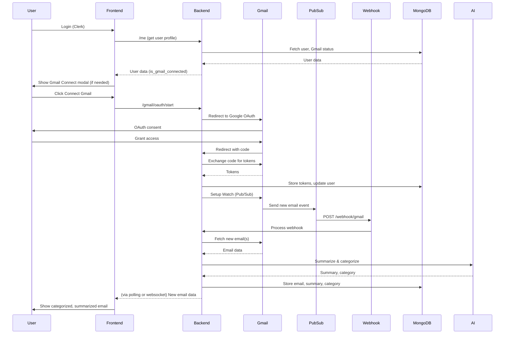

# Architecture Overview

TidyMail is designed for robust, secure, and scalable AI-powered email management. This document explains the high-level architecture, request flows, and data models.

---

## 1. High-Level Architecture

- **Frontend:** React + Tailwind, communicates with FastAPI backend via REST, manages OAuth state, and displays categorized/summarized emails.
- **Backend:** FastAPI, handles authentication, Gmail OAuth, Pub/Sub webhook, email processing, AI summarization/classification, and MongoDB storage.
- **Database:** MongoDB, stores users, OAuth tokens, and processed emails.
- **AI:** Gemini API (Google) for summarization and classification.
- **Gmail Integration:** OAuth 2.0 for user consent, Google Pub/Sub for real-time notifications, webhook for event ingestion.

---

## 2. Gmail OAuth Flow
1. User logs in via Clerk (frontend)
2. If Gmail not connected, frontend shows Connect Gmail modal
3. User clicks Connect → frontend calls `/gmail/oauth/start`
4. Backend generates OAuth URL + state, returns to frontend
5. Frontend redirects user to Google OAuth
6. User grants access, Google redirects to `/gmail/oauth/callback` with code/state
7. Backend exchanges code for tokens, stores in MongoDB, sets up Gmail Watch (Pub/Sub)

---

## 3. Pub/Sub + Webhook Flow
1. Gmail sends new email event to Pub/Sub topic
2. Pub/Sub pushes event to backend `/webhook/gmail`
3. Backend fetches new emails from Gmail API
4. Each email is summarized and categorized by AI
5. Results are stored in MongoDB
6. Frontend fetches new emails (polling or websocket)

---

## 4. Email Fetch, Summarize, Store
- On webhook event, backend fetches new emails using Gmail historyId
- For each new email:
  - Parse sender, subject, body
  - Summarize with Gemini API
  - Classify with Gemini API
  - Store all results in MongoDB

---

## 5. MongoDB Schema (Simplified)

### User
```json
{
  "clerk_user_id": "user_abc123",
  "email": "user@gmail.com",
  "is_gmail_connected": true,
  "gmail_email": "user@gmail.com",
  "gmail_connected_at": "2025-06-21T10:00:00Z",
  ...
}
```

### Email
```json
{
  "user_id": "user_abc123",
  "gmail_id": "1853d239248aee99",
  "subject": "Interview Invitation",
  "body": "Hi, we'd love to invite you...",
  "category": "Job Opportunity",
  "summary": ["Interview invitation from OpenAI", "Contact details included"],
  ...
}
```

---

## 6. Frontend Structure & State Flow
- **Main Components:**
  - GmailConnectModal: Handles OAuth flow
  - EmailList: Displays categorized/summarized emails
  - EmailDetail: Shows full email and summary
- **State:**
  - User profile (from `/me`)
  - Gmail connection status
  - Email list (from `/emails/emails`)
  - UI state for modals, loading, errors

---

## 7. Sequence Diagram



---

## 8. Request Lifecycle Example

- `/webhook/gmail` receives Pub/Sub event
- Backend decodes event, extracts user/email
- Fetches new emails from Gmail API (using historyId)
- For each email:
  - Summarize and categorize with AI
  - Store in MongoDB
- Frontend fetches new emails via `/emails/emails`
- User sees updated inbox 